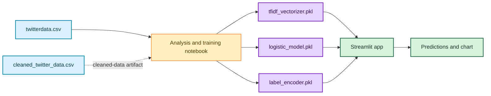
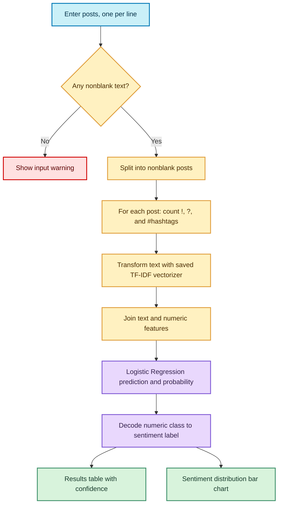
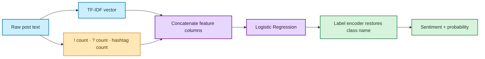
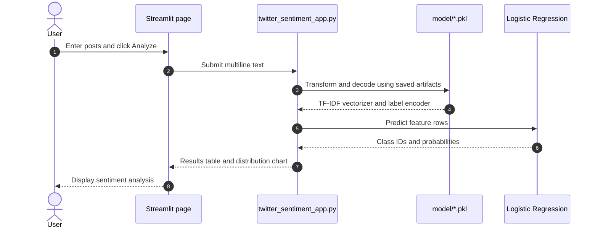

# Twitter Sentiment Analyzer

A Streamlit application that classifies tweet-like text as **negative** or **positive**. Enter several posts, one per line, to get a prediction and confidence for each; the app also summarizes the batch in a bar chart.


## Contents

- [What it does](#what-it-does)
- [Project layout](#project-layout)
- [How the application works](#how-the-application-works)
- [Model and data](#model-and-data)
- [Setup and launch](#setup-and-launch)
- [Using the app](#using-the-app)
- [Retraining notes](#retraining-notes)
- [Limitations](#limitations)

## What it does

- Accepts one or more tweets or comments, separated by newlines.
- Uses a saved TF-IDF vectorizer and Logistic Regression classifier.
- Adds exclamation-mark, question-mark, and hashtag counts to the text features.
- Displays each prediction with a confidence value and plots the sentiment counts.
- Runs locally; the app code does not send submitted text to a remote service.

## Project layout

```text
python programming project/
├── README.md
├── twitterdata.csv                     # Raw tweet data used in notebook work
├── cleaned_twitter_data.csv            # Prepared text/label dataset
├── Python_Project(sentiment analysis).ipynb
├── model/
│   ├── label_encoder.pkl
│   ├── logistic_model.pkl
│   └── tfidf_vectorizer.pkl
└── twitter-sentiment-app/
    └── twitter_sentiment_app.py
```

The Streamlit script resolves `../model` relative to its own location. Keep the `model` directory beside `twitter-sentiment-app` as shown, and retain all three `.pkl` files.



## How the application works



### Prediction features

For each submitted post, the app forms a sparse feature row from:

1. TF-IDF representation from the saved vectorizer.
2. Count of `!` characters.
3. Count of `?` characters.
4. Count of hashtag tokens matching `#\w+`.



## Model and data

The notebook contains exploratory analysis and several modeling experiments. The final artifact-export section used by the app describes this model setup:

| Component | Configuration |
| --- | --- |
| Text vectorizer | `TfidfVectorizer(max_features=50000, stop_words="english")` |
| Extra features | Exclamation count, question-mark count, hashtag count |
| Classifier | `LogisticRegression(max_iter=300)` |
| Labels | Raw polarity `0` mapped to `negative`; `4` mapped to `positive` |
| Train/test split | 90% training, 10% test, `random_state=42` |
| Evaluation | Notebook computes and prints test accuracy; no fixed score is asserted here |

The notebook also contains other experiments, including cleaned text, smaller samples, and neural-network examples. These are not loaded by the Streamlit app. The app uses the three files in `model/`.

The raw CSV has six fields: polarity, tweet ID, date, query, user, and tweet text. The cleaned CSV contains polarity, original tweet text, and processed text. The `cleaned_twitter_data.csv` file is a large dataset artifact; it is not required just to run the already-trained app.

## Setup and launch

Use Python 3 and run these commands from the project root (the directory containing this README).

```powershell
py -m venv .venv
.\.venv\Scripts\Activate.ps1
python -m pip install --upgrade pip
python -m pip install streamlit pandas numpy matplotlib scipy scikit-learn joblib
streamlit run .\twitter-sentiment-app\twitter_sentiment_app.py
```

Streamlit prints a local URL, usually `http://localhost:8501`, and may open it in a browser. If PowerShell prevents activation, run the pip and Streamlit commands with `.venv\Scripts\python.exe` instead.

The model files are loaded when the app starts. If startup reports a missing model, check that the three `.pkl` files exist in `model/` and that the folder layout matches the tree above.



## Using the app

1. Enter one post per line in the text box.
2. Select **Analyze Sentiment**.
3. Review the predicted label and confidence for each post.
4. Compare the batch counts in the sentiment distribution chart.

Blank lines are ignored. If all input is blank, the app displays a warning instead of making a prediction.

## Retraining notes

The notebook is an analysis workspace rather than a clean, one-command training script. Before retraining:

- Replace the hard-coded Windows CSV path in the relevant notebook cells with a path valid on your machine.
- Run the final deployed-model section, not just an earlier experimental section.
- Keep label mapping, vectorizer settings, feature order, and feature-count logic identical to the app.
- Export `tfidf_vectorizer.pkl`, `logistic_model.pkl`, and `label_encoder.pkl` into the root `model/` directory.
- Confirm predictions and probability indexing against `lr_model.classes_`; the current app expects class IDs to correspond to the encoder's integer labels.

The model and vectorizer are loaded with `joblib`. Only load artifacts from a trusted source; serialized pickle-based files can execute code when loaded.

## Limitations

- Predictions are limited to the two labels represented by the shipped model: negative and positive.
- Confidence is a model probability, not a guarantee that a prediction is correct.
- Sarcasm, slang, context, multilingual text, and changes in platform language may reduce quality.
- The app sends original input text to the vectorizer. The notebook also explores cleaned text, so any replacement model must use a preprocessing strategy compatible with inference.
- The notebook's hard-coded local dataset path means it may need editing before it can be rerun elsewhere.
- The repository does not currently include a dependency lockfile or automated tests.